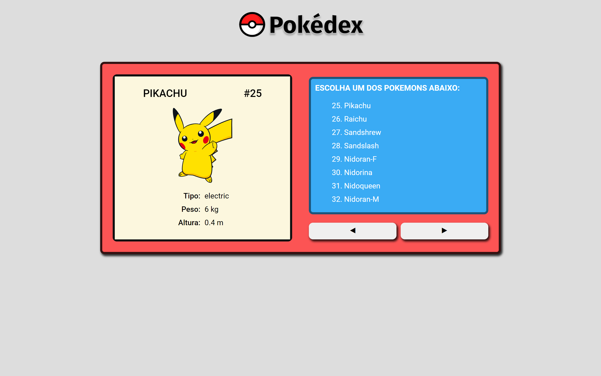
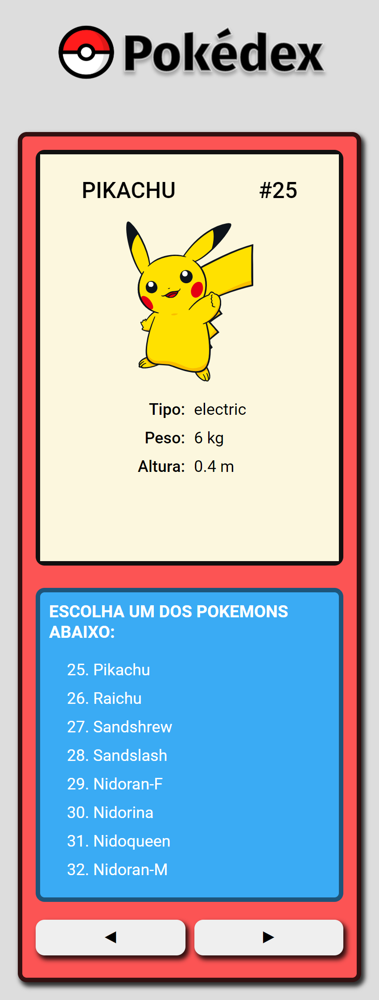

# POKÉDEX

Este projeto se trata de uma pokédex onde são mostrados todos os Pokémons e alguns de seus dados como o tipo, peso e altura. Todos esses dados são advindos da API [PokeAPI](https://pokeapi.co/).

## Tabela de Conteúdos

* [Visão Geral](#visao-geral)
  * [O Projeto](#o-projeto)
  * [Screenshot](#screenshot)
  * [Links](#links)
* [Instalação](#instalação)
* [Tecnologias](#tecnologias)
* [Autor](#autor)
* [Licença](#licença)


## Visão Geral

### O Projeto

Neste projeto os usuários serão capazes de:

- Visualizar o layout ideal dependendo do tamanho de tela do dispositivo
- Ver os estados de foco para todos os elementos interativos na página
- Visualizar cada Pokémon ao clicá-lo na tela


### Screenshot

#### Desktop


#### Mobile



### Links

- Live Site URL: [Demo](https://pokedexv2.netlify.app/) 


## Instalação

Antes de começar, você precisa ter instalado em sua máquina o [Node.js](https://nodejs.org/en/).

Após instalar o Node, clone o projeto e acesse a pasta onde ele está.

```git
git clone https://github.com/Makson19/pokedex-react.git

cd pokedex-react
```

Execute os comandos abaixo para instalar as dependecias do projeto e para executá-lo, respectivamente.

```js
npm install

npm start
```


## Tecnologias

- HTML5
- CSS
- [React](https://reactjs.org/)
- [Styled Components](https://styled-components.com/) 


## Autor

- Frontend Mentor - [@Makson19](https://www.frontendmentor.io/profile/Makson19)
- Github - [Makson19](https://github.com/Makson19)
- Codepen - [@Makson19](https://codepen.io/Makson19)


## Licença

- [MIT](./LICENSE)